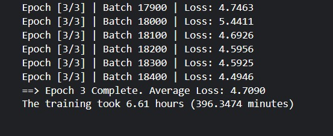

# Seq2Seq Machine Translation  English to French from Scratch

Building a sequence-to-sequence neural machine translation model **entirely from scratch** in PyTorch, trained on 150,000 English-French sentence pairs. The project also benchmarks the custom model against **Helsinki-NLP's MarianMT**, a production-grade pretrained translation system, to give a direct qualitative comparison between a from-scratch implementation and a state-of-the-art model.

---

## What This Project Covers

| Section | What was built |
|---|---|
| Architecture | LSTM Encoder-Decoder with teacher forcing |
| Tokenizer | GPT-2 BPE, shared across both languages |
| Data pipeline | OPUS-100 with a multi-stage cleaning and filtering step |
| Training | Mixed precision + gradient accumulation on a single Kaggle T4 GPU |
| Evaluation | Cross-entropy loss on a held-out 2,000-example test set |
| Comparison | Side-by-side output: custom model vs MarianMT pretrained baseline |

---

## Architecture  LSTM Encoder-Decoder

The model follows the classic seq2seq design introduced in Sutskever et al. (2014): an encoder compresses the full source sentence into a fixed-size vector, and a decoder unrolls that vector token-by-token to produce the translation.

### Encoder

```
Input token IDs  →  Embedding layer (256-dim)  →  LSTM (512 hidden units)
                                                         ↓
                                               Final hidden state (h_n, c_n)
                                               = compressed context vector
```

The encoder processes the **entire source sequence in one pass**. Only the final `(h_n, c_n)` tuple is kept — this is the bottleneck that forces the model to compress all meaning from the source into a fixed 512-dimensional vector before the decoder sees a single target token.

**Why `padding_idx` on the embedding layer?** Padding tokens carry no semantic content. Telling the embedding layer to keep their vectors at zero prevents gradient updates from being influenced by padding — which would add noise to the learned representations of real words.

### Decoder

```
Previous token  →  Embedding (256-dim)  →  LSTM (512 hidden units)  →  Linear (vocab_size)
                         ↑                         ↑
                  Previous hidden state (h, c) passed in from encoder at step 0,
                  then from decoder's own previous step onwards
```

The decoder runs **one token at a time** in a loop, unlike the encoder which processes the full sequence at once. At each step it takes the previous token and the previous hidden state, and outputs a probability distribution over the full vocabulary via a linear projection. The token with the highest probability is taken as the prediction.

**Why not Transformer attention?** This is a deliberate architectural choice for a from-scratch implementation. An LSTM seq2seq forces a deep understanding of the information bottleneck problem — the entire source sentence must be encoded into a single fixed-size vector. Transformer attention sidesteps this by letting the decoder directly attend to all encoder positions. Building the constrained version first makes the architectural motivation for attention concrete.

### Hyperparameters

| Parameter | Value | Why |
|---|---|---|
| Embedding dim | 256 | Dense enough to capture subword semantics without being too expensive |
| Hidden state dim | 512 | Larger than embedding dim — the LSTM needs room to store state across many steps |
| Vocab size | GPT-2 vocab (~50,257 + 1 PAD) | Shared across encoder and decoder (same tokenizer for both languages) |
| Optimizer | Adam, lr=0.001 | Adaptive per-parameter learning rates handle the different gradient scales in embeddings vs LSTM weights |
| Loss | CrossEntropyLoss, `ignore_index=PAD_ID` | Padding positions are excluded from the gradient — the model is not penalised for what it outputs at padded positions |

---

## Teacher Forcing  What It Is and Why It Matters

During training, the decoder has two choices for what token to feed as input at step `t`:
1. **Its own prediction** from step `t-1` — what it would see at inference time
2. **The ground-truth token** from step `t-1` — the correct answer

Using the ground truth is called **teacher forcing**. A ratio of 0.5 means 50% of steps use the ground truth and 50% use the model's own prediction:

```python
if targ is not None and torch.rand(1).item() < teacher_forcing_ratio:
    input_token = targ[:, i]   # ground truth
else:
    input_token = top_token    # model's own prediction
```

**Why 50% and not 100%?** Pure teacher forcing (100%) trains faster but creates a gap between training and inference — at inference time there is no ground truth to feed, so the model has never learned to recover from its own mistakes. 50% forces the model to handle both situations, making it more robust at test time.

**At evaluation, teacher forcing is set to 0.0** — the model runs entirely on its own predictions, which is the realistic inference scenario.

---

## Tokenizer  GPT-2 BPE Shared Across Both Languages

Rather than training separate tokenizers for English and French, **a single shared GPT-2 BPE tokenizer is used for both**. This is a deliberate simplification with real consequences:

- GPT-2's vocabulary was trained on English web text, so French subwords are represented less efficiently — common French words may be split into more tokens than they would be with a French-trained tokenizer
- The upside is a simpler architecture: the encoder and decoder share the same embedding space and the same `vocab_size`, so no cross-lingual projection is needed

**The `[PAD]` token problem:** GPT-2 has no native padding token. The tokenizer's default fallback is to use `<eos>` as pad, which creates the same bug as in standard LLM fine-tuning — the model cannot distinguish "end of sequence" from "padded position" during loss computation. A dedicated `[PAD]` token is added:

```python
tokenizer.add_special_tokens({"pad_token": "[PAD]"})
```

`BOS_ID` (the `<|endoftext|>` token, ID 50256) is extracted at setup time and used as the **decoder's start token** — the first input fed to the decoder before it has generated anything.

---

## Data Pipeline  Multi-Stage Cleaning Before Tokenization

The raw OPUS-100 dataset contains noise that, if left in, corrupts training. A four-stage filter is applied before any tokenization:

```
Raw OPUS-100 row
      ↓
1. Structural check — skip rows where "en" or "fr" key is missing (None-type crashes)
      ↓
2. Empty string check — skip rows where either language is blank after stripping
      ↓
3. Length filter — skip rows where either string exceeds 1,000 characters
      (~200-250 words; extreme outliers that break sequence length assumptions)
      ↓
4. Identity filter — skip rows where en == fr (copy artifacts in the dataset)
      ↓
5. Tokenize with truncation=True, max_length=64
```

**Why drop rather than truncate at step 3?** Truncating mid-sentence breaks sentence structure — the model sees a source sentence that ends abruptly and a target sentence that may not match the truncated portion at all. Dropping the row entirely is cleaner: the training signal is lost but at least it is not wrong.

**Why `max_length=64` at tokenization?** On a 16 GB T4, a batch of 8 sequences of 512 tokens would exhaust VRAM. 64 tokens covers the majority of short-to-medium sentences in OPUS-100 and makes batch processing tractable. The trade-off is that long sentences are truncated — acceptable for a demonstration but would need to be increased for production use.

**Dataset scale decision:** OPUS-100 contains 1,000,000 English-French pairs. Training was capped at 150,000 (15%) due to Kaggle's 12-hour session limit — training on 150k already took over 6 hours. The full validation and test splits (2,000 examples each) are kept untouched to ensure evaluation reflects the full distribution.

---

## Custom Collator  Dynamic Padding per Batch

Sequences in a batch have different lengths. The custom `padding_function` collator pads each batch to the **longest sequence in that specific batch**, not to a global maximum:

```python
en_padded = pad_sequence(en_batch, batch_first=True, padding_value=PAD_ID)
fr_padded = pad_sequence(fr_batch, batch_first=True, padding_value=PAD_ID)
```

**Why this matters:** if all batches were padded to the global maximum (64 tokens), short-sentence batches would be mostly padding — wasting compute and memory on tokens the loss ignores anyway. Dynamic padding keeps each batch as compact as possible.

---

## Training  Mixed Precision + Gradient Accumulation

Two techniques are combined to make training feasible on limited hardware:

### Mixed Precision (`autocast` + `GradScaler`)

```python
with torch.amp.autocast(device_type='cuda'):
    output = model_f(src, trg, teacher_forcing_ratio=0.5)
    loss = criterion(...) / accumulation_steps

scaler.scale(loss).backward()
```

FP16 (16-bit floats) uses half the memory and runs faster on T4's Tensor Cores compared to FP32. The `GradScaler` prevents FP16 gradients from underflowing to zero by scaling the loss up before the backward pass and scaling it back down before the optimizer step.

### Gradient Accumulation (effective batch size 64)

```python
accumulation_steps = 8  # physical batch 8 × accumulation 8 = effective batch 64
```

A physical batch of 8 sequences fits in VRAM. Accumulating gradients across 8 batches before calling `optimizer.step()` simulates a batch of 64. **The loss is divided by `accumulation_steps` before each backward pass** — this is critical. Without the division, the accumulated gradients would be 8× larger than intended, effectively multiplying the learning rate by 8 and causing divergence.

### Gradient Clipping

```python
torch.nn.utils.clip_grad_norm_(model_f.parameters(), max_norm=1.0)
```

LSTMs are particularly prone to **exploding gradients** — when long sequences cause gradients to multiply across many time steps, producing values that overflow and make weights diverge. Clipping at norm 1.0 rescales the entire gradient vector if its magnitude exceeds 1.0, keeping updates bounded regardless of sequence length.

**Clipping must happen after `scaler.unscale_(optimizer)`** — the GradScaler inflates gradient magnitudes as part of its FP16 handling. Clipping before unscaling would clip against the inflated values, not the true gradients.

---

## Evaluation Design

Two deliberate decisions in the evaluation loop:

**1. `teacher_forcing_ratio=0.0`** — the model generates with no ground-truth guidance, exactly as it would at inference time. Using teacher forcing during evaluation would inflate the score by giving the model hints it will not have in production.

**2. `targ=None` is passed to the model** — the decoder uses a fixed `max_length=20` when no target is provided, avoiding the subtle bug of leaking the target sequence length to the decoder. If `targ` were passed, the decoder would know exactly how many tokens to generate — information it would not have in real use.

**3. Sequence length alignment before loss computation** — encoder and decoder may produce outputs of slightly different lengths when running freely. The minimum of the two lengths is used to align them before flattening for `CrossEntropyLoss`, preventing shape mismatches.

---

## Results & Analysis

| Metric | Value |
|---|---|
| Training loss (epoch 3) | ~4.7 |
| Average test loss | ~6.3 |
| Training time (150k samples, 3 epochs) | ~6 hours on Kaggle T4 |



The gap between training loss (~4.7) and test loss (~6.3) looks like overfitting at first glance. The real cause is **data scarcity**: the model was trained on 15% of the available data and encountered a much wider variety of vocabulary and sentence structures in the test set than it saw during training. The training loss drops consistently across all 3 epochs — the model is learning — but it has simply not been exposed to enough of the language's variation to generalise.

**What would improve results:**
- Full 1,000,000 training pairs
- More than 3 epochs
- Larger hidden state (currently 512)
- Attention mechanism to overcome the fixed-size bottleneck

---

## Pretrained Baseline  Helsinki-NLP MarianMT

As a reference point, `opus-mt-en-fr` is loaded directly from HuggingFace and run on the same input. MarianMT is a production Neural Machine Translation system trained on the full OPUS corpus — it represents what the custom model would converge toward with enough data and compute.

**Handling the 512-token limit:** MarianMT caps input at 512 tokens. For long texts, the input is first split into sentences using NLTK's `sent_tokenize`, each sentence is translated independently, then the translations are joined. This sliding-window approach avoids truncation artifacts at the cost of losing cross-sentence context.

The side-by-side comparison between the custom model and MarianMT makes the gap concrete and quantifiable — and frames the project's results honestly within its hardware constraints.

---

## Memory Management  Three Layers of Defence

The notebook applies memory management at three levels, each addressing a different failure mode:

```python
# 1. Synchronous CUDA errors — surface at the exact crashing line
os.environ["CUDA_LAUNCH_BLOCKING"] = "1"

# 2. Memory fragmentation — allow allocator to grow segments dynamically
os.environ["PYTORCH_CUDA_ALLOC_CONF"] = "expandable_segments:True"

# 3. Stale tensors from previous Kaggle session runs
gc.collect()
torch.cuda.empty_cache()
```

`CUDA_LAUNCH_BLOCKING=1` is a debugging tool — GPU operations are normally asynchronous, so errors surface several operations later, making them hard to trace. Setting it to 1 makes every CUDA call block until complete, pinpointing the exact line where an error originates.

---

## Model Saving  `state_dict` Only

```python
torch.save(model_f.state_dict(), "seq2seq_french_model1.pt")
```

Only the learned weights are saved, not the full model object. Saving the full object with `torch.save(model)` serialises the Python class definition alongside the weights, which ties the saved file to the exact file structure and class names of the original notebook. If anything is renamed or refactored, the file becomes unloadable. Saving `state_dict` only means the architecture can be redefined independently and the weights loaded cleanly into any matching structure.

---

## Web Application  FastAPI

The project ships with a FastAPI web app that exposes both translation models through a REST API and a browser UI — turning the notebook experiment into a deployable product.

### Project Structure

```
├── machine-translate-final.ipynb               #the Seq2Seq with LSTM model (the entier process step by step)
├── my_backend.py                               # FastAPI app
├── machine.py                                  # translate_large_text()  MarianMT inference logic
├── requirements.txt
├── models
├   └──architecture.py
├      seq2seq_french_model.pt                           
├── static/                                     # CSS, JS assets 
├   └──script_2.js 
├      style_2.css                                  
└── templates/
    └── index_2.html                            # Browser frontend (Jinja2)
```

### Endpoints

`GET /` — serves the HTML frontend

`POST /translation` — accepts JSON and returns the translated text:

```json
// Request
{
  "text": "Artificial intelligence is changing the world.",
  "language_target": "French",
  "model": "MarianMT"
}

// Response
{
  "translated_text": "L'intelligence artificielle change le monde."
}
```

### Routing Logic

```
POST /translation
      ↓
model == "MarianMT"?
  ├── language_target == "French"  →  Helsinki-NLP/opus-mt-en-fr
  └── language_target == "Arabic"  →  Helsinki-NLP/opus-mt-en-ar

model == "Seq2Seq" (custom)
  └── returns placeholder — see note below
```

**Why two models in the same API?** The app is designed to make the gap between the two approaches concrete and interactive. MarianMT (production-grade, trained on the full OPUS corpus) produces fluent translations. The custom Seq2Seq LSTM — trained on only 150,000 pairs (15% of the available data) due to hardware constraints — produces noticeably weaker output. Exposing both through the same interface makes the comparison tangible for anyone running the app, not just readable in a chart.

**Note on the custom Seq2Seq route:** the endpoint currently returns a placeholder response. The model trains and runs correctly in the notebook but its output quality is limited by the dataset size — 150k pairs is not enough for the LSTM to generalise across the full vocabulary and sentence variety of English-French translation. Full results would require training on the complete 1,000,000 pairs for more epochs. Integrating the trained weights into the API endpoint is the intended next step.

### Running Locally

```bash
pip install -r requirements.txt
uvicorn my_backend:app --reload
```

Then open `http://localhost:8000` in your browser.

---

## Stack

| Library | Role |
|---|---|
| PyTorch | Model, training loop, mixed precision, gradient accumulation |
| `datasets` (HuggingFace) | OPUS-100 loading and batch mapping |
| `transformers` | GPT-2 tokenizer, MarianMT pretrained baseline |
| NLTK `sent_tokenize` | Sentence splitting for long-text MarianMT inference |
| Matplotlib | Training/test loss visualisation (3-panel chart) |
| FastAPI | REST API and browser UI serving |
| Jinja2 | HTML templating for the frontend |
| Uvicorn | ASGI server for running the FastAPI app |


##Demo
<video src="https://raw.githubusercontent.com/sbahamine2005-hue/machine_translation/main/demo.mp4" controls="controls" style="max-width: 100%; height: auto;"></video>
